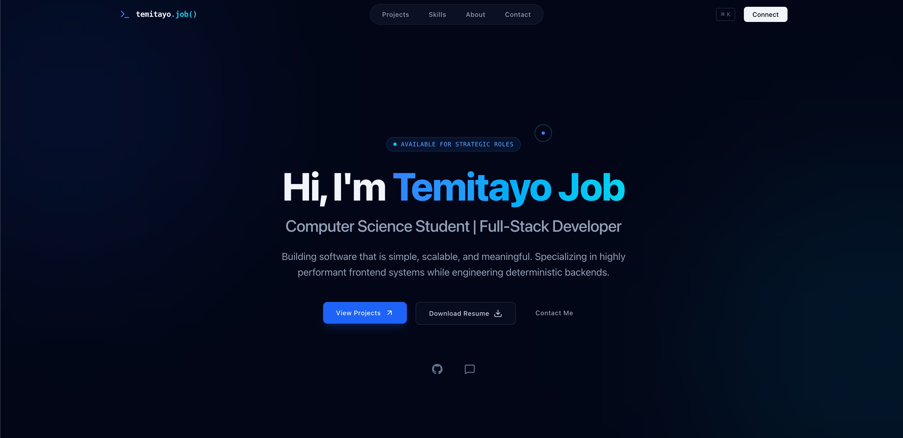

# 🚀 Temitayo Job – Portfolio

Welcome to my personal portfolio website! This project showcases my skills, projects, and journey as a Full-Stack Developer. It serves as a central place where recruiters, developers, and potential clients can learn more about me and my work.

## 🌐 Live Demo

🔗 https://portfolio-v1-eta-jade.vercel.app/

## 📸 Preview




---

## ✨ Features

- Modern and responsive design
- Smooth animations with Framer Motion
- Dark-themed UI
- Project showcase
- Skills section
- About Me section
- Contact section
- Mobile-friendly layout
- Fast performance with Next.js

---

## 🛠️ Built With

- **Next.js**
- **React**
- **TypeScript**
- **Tailwind CSS**
- **Framer Motion**
- **Lucide React**
- **Vercel**

---

## 📂 Folder Structure

```text
.
├── components/
├── public/
├── pages/
├── styles/
├── hooks/
├── utils/
├── types/
└── README.md
```

---

## 🚀 Getting Started

Clone the repository

```bash
git clone https://github.com/temitayo1239/portfolio-v1.git
```

Navigate into the project

```bash
cd portfolio-v1
```

Install dependencies

```bash
npm install
```

Run the development server

```bash
npm run dev
```

Open your browser and visit

```
http://localhost:3000
```

---

## 📬 Contact

**Temitayo Job**

- Portfolio: https://portfolio-v1-eta-jade.vercel.app/
- GitHub: https://github.com/temitayo1239
- Email: temitayojob19@gmail.com

---

## 💡 Future Improvements

- Blog section
- Project filtering
- Multi-language support
- Light/Dark theme toggle
- Downloadable résumé
- Integrated contact form
- CMS for managing projects

---

## ⭐ Support

If you like this project, consider giving it a ⭐ on GitHub. It helps support my work and encourages future development.

---

## 📄 License

This project is open-source and available under the MIT License.

---

Made with ❤️ by **Temitayo Job**